<h2 align="left">Hi, I'm Amit 👋</h2>

🎓 CSE Student at **MNIT Jaipur**  
💻 Full-Stack **MERN Developer** | 🤖 **Machine Learning Enthusiast**

---

  
  

---

  

---

### 🛠 Tech Stack

  
  
  
  
  
  
  
  
  
  
  
  
  
  
  
  
  
  
  
  
  

---

### 🌐 Connect with Me

  
  
  

---

 

  

  

